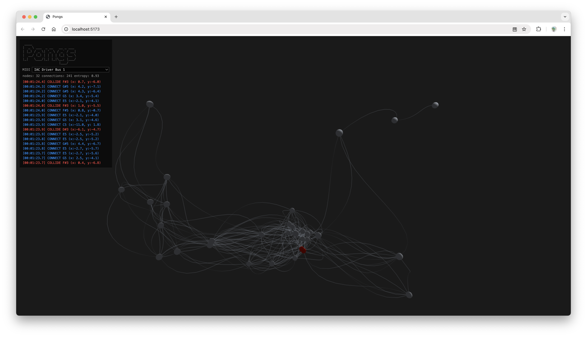

# Pongs

A generative MIDI instrument driven by emergent physics. A WebGPU 3D nodal system runs fullscreen, self-organises, and fires MIDI notes — no interaction required.



---

## What it does

Up to 32 nodes float and oscillate in 3D space, connected by Bézier curves when they drift close enough. Three types of physics events generate MIDI notes in real time:

| Event | Trigger | Octave |
|---|---|---|
| **Spawn** | A new node appears | C4–B4 |
| **Connect** | Two nodes form a new connection | C5–B5 |
| **Collide** | Two nodes pass within collision range | C3–B3 |

Pitch within each octave is mapped to the node's x-position in world space — left edge = C, right edge = B. The HUD console (top-left) shows live system state and a scrolling event log.

---

## Requirements

- **Browser:** Chrome 113+, Edge 113+, or Safari 18+ (WebGPU required — Firefox not supported)
- **MIDI:** any DAW or virtual MIDI device; the app selects the first available output on startup
- **Node:** for local dev only

---

## Getting started

```bash
npm install
npm run dev      # http://localhost:5173
```

Open in a Chromium browser. Connect a MIDI device or virtual port beforehand — the app requests MIDI access on load and logs which output it selects.

```bash
npm run build    # production build → dist/
npm run preview  # serve dist/ locally
```

---

## Physics

Nodes oscillate sinusoidally around a home position with spring damping. A global **entropy** value accumulates over time and amplifies oscillation amplitude — the longer the system runs, the more chaotic the motion. Spawn and delete events inject radial impulses and wind bursts into nearby nodes.

---

## Architecture

```
src/
  main.ts          — WebGPU init, resize, render loop
  events.ts        — typed synchronous event bus
  midi.ts          — Web MIDI API output
  physics.ts       — spring-damped oscillator + entropy + wind
  scene.ts         — node list, connection graph, collision detection
  renderer.ts      — WebGPU renderer: MSAA 4×, two pipelines
  ui/
    Console.ts     — HUD overlay (pure DOM, no framework)
  models/
    ModelSpawner.ts — probabilistic node spawner/evictor
  shaders/
    solid.wgsl      — Blinn-Phong sphere pipeline
    connection.wgsl — procedural alpha line pipeline
```

**Stack:** TypeScript 5.6 · Vite 6 · WebGPU · Web MIDI API · zero runtime dependencies
